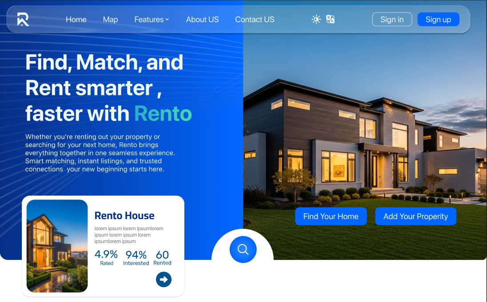

# ✨ Rento — Real Estate Management Platform

### _Designed by Uxplorers_

  

---

## 🚀 Overview

Rento is a modern, user-focused real-estate management platform designed with clarity, trust, and a premium visual identity.  
This repository includes the **official UI/UX Figma design** and the **full case study**, documenting research, flows, and design decisions.

---

## 🎨 Figma Files

### 🔗 Rento Website (UI Design)

Explore the complete interface:  
👉 https://www.figma.com/design/08UNLeHpSYqstLFLKm7aHn/Rento-Pro?node-id=146-140

### 📘 Rento Case Study

Full UX process and decision-making:  
👉 https://www.figma.com/design/M11EdEKKo2yEcR58AJyo0q/Rento-Case-Study?node-id=0-1

---

## 🌟 Key Highlights

- 🏡 Modern & clean real-estate UI design
- 📱 Fully responsive layout
- 🎯 UX-driven flows for owners & renters
- 📊 Dashboard and property management screens
- 🎨 Strong identity with consistent typography & colors
- 🔍 Smooth & clear user navigation
