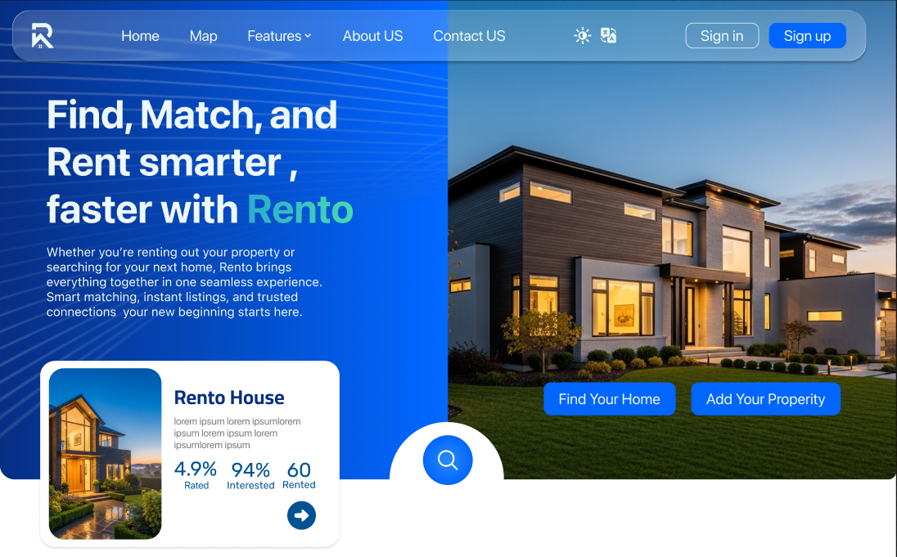

# ✨ Rento — Real Estate Management Platform

### *Designed by Uxplorers*

  

---

## 🚀 Overview

Rento is a modern, user-focused real-estate management platform designed with clarity, trust, and a premium visual identity.
This repository includes the **official UI/UX Figma design** and the **full case study**, documenting research, user flows, and design decisions.

---

## 🎨 Figma Files

### 🔗 Rento Website (UI Design)

Explore the complete interface:
👉 [https://www.figma.com/design/08UNLeHpSYqstLFLKm7aHn/Rento-Pro?node-id=146-140](https://www.figma.com/design/08UNLeHpSYqstLFLKm7aHn/Rento-Pro?node-id=146-140)

### 📘 Rento Case Study

Full UX process and decision-making:
👉 [https://www.figma.com/design/M11EdEKKo2yEcR58AJyo0q/Rento-Case-Study?node-id=0-1](https://www.figma.com/design/M11EdEKKo2yEcR58AJyo0q/Rento-Case-Study?node-id=0-1)

###  **[Rento Google Drive](https://drive.google.com/drive/folders/1bMcGYRnySYnTW1ZXPOBPtMmNC-xxZfGb?usp=drive_link)**

All files used in the Rento project.

---

## 🌟 Key Highlights

* 🏡 Modern & clean real-estate UI design
* 📱 Fully responsive layout
* 🎯 UX-driven flows for both property owners & renters
* 📊 Dashboard and property management screens
* 🎨 Strong identity with consistent typography & color system
* 🔍 Smooth & intuitive navigation

---

## 👥 Meet Our Team

* **AbdulRahman AbdulHalem**
* **Mohammed Assad**
* **Eman Alghrabawy**
* **Rawan Sheta**
* **Verena Wageh**
* **Youssef Albosaty**
